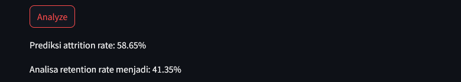

Menggunakan Streamlit untuk Interfacenya <br>
Setup Env terlebih dahulu <br>
```
python -m venv myenv
myenv\Scripts\activate

pip install streamlit
pip install joblib
pip install scikit-learn==1.2.2
```

Jika sudah di install run dengan
```
streamlit run app.py
```

Hasilnya seperti ini interfacenya


